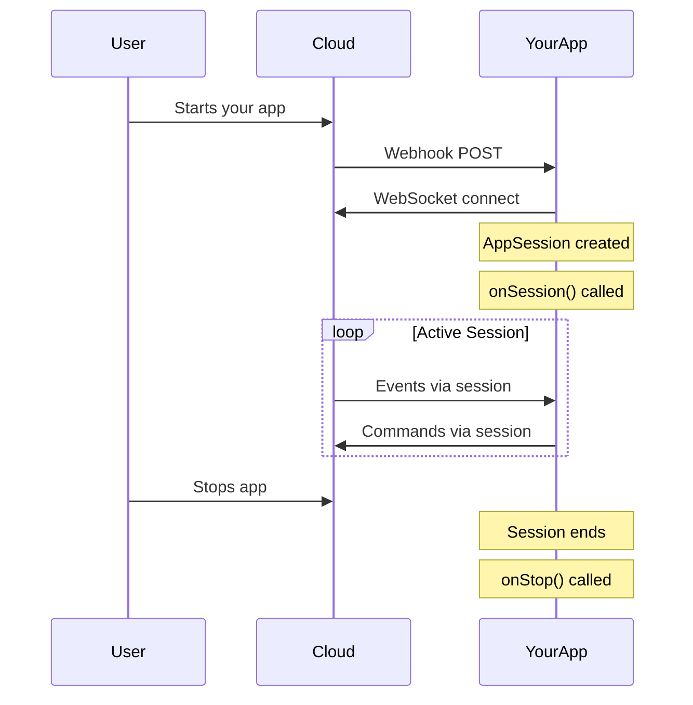

`AppSession` represents one user's active connection to your app. Each time a user starts your app on their glasses, a new AppSession is created with a unique ID.

## Core Concept

When you extend `AppServer`, you override `onSession()` which receives an `AppSession` object:

```typescript
import { AppServer, AppSession } from '@mentraos/sdk';

class MyApp extends AppServer {
  protected async onSession(session: AppSession, sessionId: string, userId: string) {
    // 'session' is the AppSession object
    // Use it to interact with this user's glasses
  }
}
```

## What AppSession Provides

AppSession is your interface to everything happening on the user's glasses:

| Property | Purpose |
|----------|---------|
| `session.events` | Subscribe to data streams (voice, buttons, sensors) |
| `session.layouts` | Update what displays on glasses |
| `session.audio` | Play audio, text-to-speech, capture voice |
| `session.camera` | Take photos, stream video |
| `session.led` | Control LED lights |
| `session.location` | Access GPS location |
| `session.dashboard` | Show persistent status info |
| `session.simpleStorage` | Store user preferences and data |
| `session.settings` | Access app settings from dev console |
| `session.capabilities` | Check what hardware is available |
| `session.logger` | Structured logging with session context |

## Session Lifecycle



### 1. Session Starts

**Cloud calls your `onSession()` with:**
- `session` - The AppSession object
- `sessionId` - Unique ID (UUID string)
- `userId` - User's ID (email)

```typescript
protected async onSession(session: AppSession, sessionId: string, userId: string) {
  session.logger.info('Session started', { sessionId, userId });

  // Set up your app for this user
  this.setupApp(session);
}
```

### 2. Session is Active

**Use the session object to interact with glasses:**

```typescript
protected async onSession(session: AppSession, sessionId: string, userId: string) {
  // Display content
  session.layouts.showTextWall('Welcome!');

  // Listen for voice input
  session.events.onTranscription((data) => {
    session.logger.info('User said:', data.text);
  });

  // Play audio
  session.audio.playTTS('Hello from your app');
}
```

### 3. Session Ends

**Session ends when:**
- User stops the app
- Glasses disconnect
- Network error occurs
- Your server calls `session.disconnect()`

```typescript
protected async onStop(sessionId: string, userId: string, reason: string) {
  // Clean up resources
  console.log(`Session ${sessionId} ended: ${reason}`);
}
```

<Info>
The `session` object is NOT available in `onStop()`. Do cleanup that doesn't require the session object.
</Info>

## One Session Per User

Each user gets their own isolated AppSession:

```typescript
class MyApp extends AppServer {
  private sessions = new Map<string, AppSession>();

  protected async onSession(session: AppSession, sessionId: string, userId: string) {
    // Store this user's session
    this.sessions.set(sessionId, session);

    session.layouts.showTextWall(`Active users: ${this.sessions.size}`);

    // Each user has independent state
    session.events.onTranscription((data) => {
      // Only this user's voice data
      session.layouts.showTextWall(`You said: ${data.text}`);
    });
  }

  protected async onStop(sessionId: string, userId: string, reason: string) {
    this.sessions.delete(sessionId);
  }
}
```

**Key points:**
- Sessions don't interfere with each other
- Each has separate event subscriptions
- Each has separate display state
- Each has separate storage (via userId)

## Session Information

Access session details:

```typescript
protected async onSession(session: AppSession, sessionId: string, userId: string) {
  // Session identifiers
  console.log('Session ID:', sessionId);  // UUID
  console.log('User ID:', userId);        // Email address

  // Device capabilities
  if (session.capabilities) {
    console.log('Device:', session.capabilities.modelName);
    console.log('Has camera:', session.capabilities.hasCamera);
    console.log('Has display:', session.capabilities.hasDisplay);
  }

  // User settings from dev console
  const theme = session.settings.get('theme', 'light');

  // User's stored data
  const savedData = await session.simpleStorage.get('preferences');
}
```

## Working with Sessions

### Store Session References

```typescript
class MyApp extends AppServer {
  private userSessions = new Map<string, AppSession>();

  protected async onSession(session: AppSession, sessionId: string, userId: string) {
    // Store by sessionId for cleanup
    this.userSessions.set(sessionId, session);

    // Or store by userId to find user's session later
    this.userSessions.set(userId, session);
  }

  // Helper to get a user's session
  private getSessionForUser(userId: string): AppSession | undefined {
    return this.userSessions.get(userId);
  }
}
```

### Session-Scoped State

```typescript
protected async onSession(session: AppSession, sessionId: string, userId: string) {
  // Store state specific to this session
  const sessionState = {
    startTime: Date.now(),
    messageCount: 0,
    currentView: 'home'
  };

  session.events.onTranscription((data) => {
    sessionState.messageCount++;

    if (data.text.includes('stats')) {
      const duration = Date.now() - sessionState.startTime;
      session.layouts.showTextWall(
        `Messages: ${sessionState.messageCount}\n` +
        `Time: ${Math.floor(duration / 1000)}s`
      );
    }
  });
}
```

### Cross-Session Communication

```typescript
class ChatApp extends AppServer {
  private activeSessions = new Map<string, AppSession>();

  protected async onSession(session: AppSession, sessionId: string, userId: string) {
    this.activeSessions.set(sessionId, session);

    // Broadcast to all connected users
    session.events.onTranscription((data) => {
      if (data.isFinal) {
        this.broadcastMessage(userId, data.text);
      }
    });
  }

  private broadcastMessage(fromUserId: string, message: string) {
    // Send to all active sessions
    for (const [sid, sess] of this.activeSessions) {
      sess.layouts.showTextWall(`${fromUserId}: ${message}`);
    }
  }

  protected async onStop(sessionId: string, userId: string, reason: string) {
    this.activeSessions.delete(sessionId);
  }
}
```

## Important Notes

<Warning>
**Don't share AppSession objects between users.** Each session is isolated and user-specific.
</Warning>

<Info>
    **UserId is persistent for each user**
If a user stops and restarts your app, they get the same userId.
</Info>

<Tip>
**Use `session.logger` for debugging.** It automatically includes session context in logs.
</Tip>

## Quick Reference

```typescript
protected async onSession(session: AppSession, sessionId: string, userId: string) {
  // Display
  session.layouts.showTextWall('Hello');

  // Events
  session.events.onTranscription(data => {});
  session.events.onButtonPress(data => {});

  // Audio
  await session.audio.playTTS('Hello');

  // Storage
  await session.simpleStorage.set('key', 'value');
  const val = await session.simpleStorage.get('key');

  // Settings
  const setting = session.settings.get('settingKey', 'default');

  // Capabilities
  if (session.capabilities?.hasCamera) {
    await session.camera.requestPhoto();
  }

  // Logging
  session.logger.info('Message', { extra: 'data' });

  // Disconnect
  session.disconnect();
}
```

## Next Steps

<CardGroup cols={2}>
  <Card title="Display & UI" icon="display" href="/app-devs/core-concepts/display/layouts">
    Control what shows on glasses
  </Card>
  <Card title="Events & Data" icon="bolt" href="/app-devs/core-concepts/app-session/events-and-data">
    Subscribe to real-time streams
  </Card>
  <Card title="Device Control" icon="microchip" href="/app-devs/core-concepts/app-session/device-control">
    Use audio, camera, LED, location
  </Card>
  <Card title="API Reference" icon="book" href="/app-devs/reference/app-session">
    Complete AppSession documentation
  </Card>
</CardGroup>
