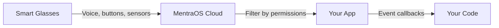

Subscribe to real-time events from glasses using `session.events`. Get voice transcription, button presses, sensor data, and more.

## Quick Start

```typescript
protected async onSession(session: AppSession, sessionId: string, userId: string) {
  // Subscribe to voice transcription
  session.events.onTranscription((data) => {
    session.logger.info('User said:', data.text);
  });

  // Subscribe to button presses
  session.events.onButtonPress((data) => {
    session.logger.info('Button pressed:', data.button);
  });
}
```

## How Events Work

Events are **real-time data streams** from the glasses. When you subscribe, your callback receives data as it happens.



## Common Events

### Voice Transcription

**Real-time speech-to-text:**

```typescript
session.events.onTranscription((data) => {
  if (data.isFinal) {
    // Final transcription - confident result
    session.layouts.showTextWall(`You said: ${data.text}`);
  } else {
    // Interim results - still processing
    session.layouts.showTextWall(`${data.text}...`);
  }
});
```

**Transcription data:**

| Field | Type | Description |
|-------|------|-------------|
| `text` | string | Transcribed text |
| `isFinal` | boolean | True if transcription is complete |
| `language` | string | Language code (e.g., 'en-US') |
| `confidence` | number | Confidence score (0-1) |

**Common pattern - wait for final:**

```typescript
session.events.onTranscription((data) => {
  // Ignore interim results
  if (!data.isFinal) return;

  // Process final transcription
  const command = data.text.toLowerCase();
  if (command.includes('help')) {
    this.showHelp(session);
  }
});
```

### Button Presses

**Hardware button events:**

```typescript
session.events.onButtonPress((data) => {
  switch (data.button) {
    case 'forward':
      this.nextPage(session);
      break;
    case 'back':
      this.previousPage(session);
      break;
    case 'select':
      this.selectItem(session);
      break;
  }
});
```

**Button data:**

| Field | Type | Description |
|-------|------|-------------|
| `button` | string | Button name ('forward', 'back', 'select', etc.) |
| `action` | string | 'press', 'release', 'long_press' |
| `timestamp` | number | When button was pressed |

### Head Position

**Detect when user looks up/down:**

```typescript
session.events.onHeadPosition((data) => {
  if (data.position === 'up') {
    // User looking up - show dashboard
    session.dashboard.content.writeToMain('Status: Active');
  } else if (data.position === 'down') {
    // User looking down
    session.dashboard.content.writeToMain('');
  }
});
```

### Location Updates

**GPS coordinates:**

```typescript
session.location.subscribeToStream({ accuracy: 'high' }, (data) => {
  session.logger.info('Location:', data.lat, data.lng);
  session.layouts.showTextWall(`Lat: ${data.lat}\nLng: ${data.lng}`);
});
```

**Location data:**

| Field | Type | Description |
|-------|------|-------------|
| `lat` | number | Latitude |
| `lng` | number | Longitude |
| `accuracy` | number | Accuracy in meters |
| `altitude` | number | Altitude in meters (optional) |
| `timestamp` | number | When location was captured |

### Phone Notifications

**Notifications from user's phone:**

```typescript
session.events.onPhoneNotification((data) => {
  session.logger.info('Notification:', data.app, data.title);

  // Filter important notifications
  if (data.app === 'Messages' || data.app === 'Slack') {
    session.dashboard.content.writeToMain(`${data.app}\n${data.title}`);
  }
});
```

**Notification data:**

| Field | Type | Description |
|-------|------|-------------|
| `app` | string | App that sent notification |
| `title` | string | Notification title |
| `text` | string | Notification body |
| `timestamp` | number | When notification arrived |

### Battery Updates

**Monitor battery levels:**

```typescript
session.events.onGlassesBatteryUpdate((data) => {
  if (data.percentage < 20) {
    session.dashboard.content.writeToMain(`⚠️ Battery: ${data.percentage}%`);
  }
});
```

## Event Reference Table

| Event | Requires Permission | Data Type |
|-------|-------------------|-----------|
| `onTranscription()` | MICROPHONE | TranscriptionData |
| `onTranslation()` | MICROPHONE | TranslationData |
| `onButtonPress()` | None | ButtonPress |
| `onHeadPosition()` | None | HeadPosition |
| `onPhoneNotification()` | READ_NOTIFICATIONS | PhoneNotification |
| `onNotificationDismissed()` | READ_NOTIFICATIONS | NotificationDismissed |
| `onGlassesBatteryUpdate()` | None | GlassesBatteryUpdate |
| `onPhoneBatteryUpdate()` | None | PhoneBatteryUpdate |
| `onGlassesConnectionState()` | None | GlassesConnectionState |
| `onVAD()` | MICROPHONE | Vad |
| `onAudioChunk()` | MICROPHONE | ArrayBuffer |

## Unsubscribing

**All event methods return an unsubscribe function:**

```typescript
protected async onSession(session: AppSession, sessionId: string, userId: string) {
  // Subscribe and store unsubscribe function
  const unsubscribe = session.events.onTranscription((data) => {
    session.logger.info(data.text);
  });

  // Later, stop listening
  setTimeout(() => {
    unsubscribe();
    session.logger.info('Stopped listening to transcription');
  }, 60000); // After 1 minute
}
```

**Conditional subscriptions:**

```typescript
protected async onSession(session: AppSession, sessionId: string, userId: string) {
  let transcriptionActive = true;
  const unsubscribe = session.events.onTranscription((data) => {
    if (!transcriptionActive) return;
    session.layouts.showTextWall(data.text);
  });

  // Disable on button press
  session.events.onButtonPress((data) => {
    if (data.button === 'select') {
      transcriptionActive = false;
      unsubscribe();
      session.layouts.showTextWall('Voice disabled');
    }
  });
}
```

## Common Patterns

### Command Processing

```typescript
protected async onSession(session: AppSession, sessionId: string, userId: string) {
  session.events.onTranscription((data) => {
    if (!data.isFinal) return;

    const text = data.text.toLowerCase();

    if (text.includes('weather')) {
      this.showWeather(session);
    } else if (text.includes('time')) {
      this.showTime(session);
    } else if (text.includes('help')) {
      this.showHelp(session);
    } else {
      session.layouts.showTextWall(`Unknown command: ${data.text}`);
    }
  });
}

private async showWeather(session: AppSession) {
  session.layouts.showReferenceCard('Weather', 'Sunny, 72°F');
}
```

### Voice + Button Navigation

```typescript
class NavigationApp extends AppServer {
  private currentPage = 0;
  private pages = ['Home', 'Settings', 'About'];

  protected async onSession(session: AppSession, sessionId: string, userId: string) {
    this.showCurrentPage(session);

    // Navigate with buttons
    session.events.onButtonPress((data) => {
      if (data.button === 'forward') {
        this.currentPage = (this.currentPage + 1) % this.pages.length;
        this.showCurrentPage(session);
      } else if (data.button === 'back') {
        this.currentPage = (this.currentPage - 1 + this.pages.length) % this.pages.length;
        this.showCurrentPage(session);
      }
    });

    // Navigate with voice
    session.events.onTranscription((data) => {
      if (!data.isFinal) return;

      const text = data.text.toLowerCase();
      if (text.includes('next')) {
        this.currentPage = (this.currentPage + 1) % this.pages.length;
        this.showCurrentPage(session);
      }
    });
  }

  private showCurrentPage(session: AppSession) {
    session.layouts.showTextWall(this.pages[this.currentPage]);
  }
}
```

### Real-Time Data Processing

```typescript
protected async onSession(session: AppSession, sessionId: string, userId: string) {
  let wordCount = 0;
  let sentenceCount = 0;

  session.events.onTranscription((data) => {
    if (data.isFinal) {
      // Count words and sentences
      const words = data.text.split(/\s+/).length;
      const sentences = data.text.split(/[.!?]+/).length;

      wordCount += words;
      sentenceCount += sentences;

      // Show stats
      session.dashboard.content.writeToMain(
        `Words: ${wordCount} | Sentences: ${sentenceCount}`
      );
    }
  });
}
```

### Notification Filtering

```typescript
protected async onSession(session: AppSession, sessionId: string, userId: string) {
  const importantApps = ['Messages', 'Slack', 'Email'];

  session.events.onPhoneNotification((data) => {
    // Only show notifications from important apps
    if (importantApps.includes(data.app)) {
      session.layouts.showDoubleTextWall({
        topText: `📱 ${data.app}`,
        bottomText: data.title
      });

      // Play sound
      session.audio.playTTS(`New ${data.app} notification`);
    }
  });
}
```

### Location-Based Features

```typescript
protected async onSession(session: AppSession, sessionId: string, userId: string) {
  const targetLat = 37.7749;
  const targetLng = -122.4194;

  session.location.subscribeToStream({ accuracy: 'high' }, (data) => {
    // Calculate distance to target
    const distance = this.calculateDistance(
      data.lat, data.lng,
      targetLat, targetLng
    );

    // Update display
    session.layouts.showTextWall(`Distance: ${distance.toFixed(2)} km`);

    // Alert when close
    if (distance < 0.1) { // Within 100m
      session.audio.playTTS('You have arrived at your destination');
    }
  });
}

private calculateDistance(lat1: number, lng1: number, lat2: number, lng2: number): number {
  // Haversine formula
  const R = 6371; // Earth radius in km
  const dLat = (lat2 - lat1) * Math.PI / 180;
  const dLng = (lng2 - lng1) * Math.PI / 180;
  const a = Math.sin(dLat/2) * Math.sin(dLat/2) +
            Math.cos(lat1 * Math.PI / 180) * Math.cos(lat2 * Math.PI / 180) *
            Math.sin(dLng/2) * Math.sin(dLng/2);
  return R * 2 * Math.atan2(Math.sqrt(a), Math.sqrt(1-a));
}
```

## Best Practices

<AccordionGroup>
  <Accordion title="Check isFinal for Transcription" icon="check">
    Always check `isFinal` to avoid processing interim results:

    ```typescript
    // ✅ Good
    session.events.onTranscription((data) => {
      if (!data.isFinal) return;
      processCommand(data.text);
    });

    // ❌ Avoid - processes every interim result
    session.events.onTranscription((data) => {
      processCommand(data.text); // Called too often
    });
    ```
  </Accordion>

  <Accordion title="Unsubscribe When Done" icon="xmark">
    Clean up subscriptions to avoid memory leaks:

    ```typescript
    // ✅ Good
    const cleanup = session.events.onTranscription(() => {});
    // Later: cleanup();

    // ❌ Avoid - subscription never cleaned up
    session.events.onTranscription(() => {}); // Leaks memory
    ```
  </Accordion>

  <Accordion title="Handle Missing Permissions" icon="lock">
    Events requiring permissions won't fire without them:

    ```typescript
    // ✅ Good - assume permissions are set in dev console
    session.events.onTranscription((data) => {
      // This only fires if MICROPHONE permission granted
    });

    // No need to check permissions in code
    // Set them in Developer Console instead
    ```
  </Accordion>

  <Accordion title="Use Appropriate Event Frequency" icon="clock">
    Some events fire very frequently:

    ```typescript
    // ✅ Good - throttle frequent events
    let lastUpdate = 0;
    session.events.onVAD((data) => {
      const now = Date.now();
      if (now - lastUpdate > 1000) { // Once per second max
        session.dashboard.content.writeToMain(data.isVoiceDetected ? '🎤' : '');
        lastUpdate = now;
      }
    });
    ```
  </Accordion>
</AccordionGroup>

## Permissions Required

Different events require different permissions:

| Permission | Events Unlocked |
|------------|----------------|
| **MICROPHONE** | Transcription, Translation, VAD, Audio Chunks |
| **LOCATION** | Location Updates |
| **READ_NOTIFICATIONS** | Phone Notifications, Notification Dismissed |
| **CAMERA** | Photo Taken, Stream Status |
| **None** | Button Press, Head Position, Battery, Connection State |

<Info>
Set permissions in the [Developer Console](https://console.mentra.glass/apps). Users approve them when installing your app.
</Info>

## Next Steps

<CardGroup cols={2}>
  <Card title="Device Control" icon="microchip" href="/app-devs/core-concepts/app-session/device-control">
    Control audio, camera, LED, location
  </Card>
  <Card title="Permissions" icon="lock" href="/app-devs/core-concepts/permissions">
    Learn about permission system
  </Card>
  <Card title="Event Manager" icon="book" href="/app-devs/reference/managers/event-manager">
    Complete event API reference
  </Card>
  <Card title="Event Types" icon="book" href="/app-devs/reference/interfaces/event-types">
    All event data structures
  </Card>
</CardGroup>
